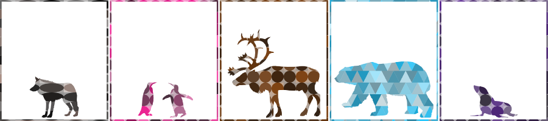
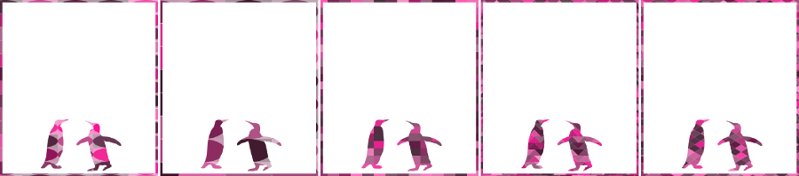

AnimalsGeometricsJS
===================
Geometrical animals it’s a generative applet to fill text and animal silhouettes with geometrical colored forms. It creates unique images to print out!

More info at: www.annacarreras.com
